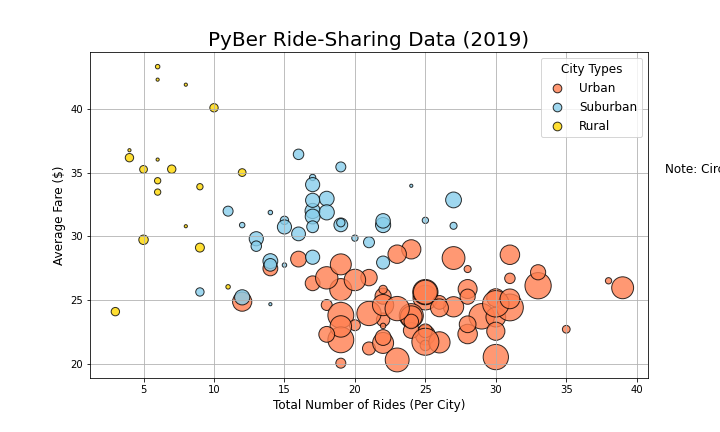
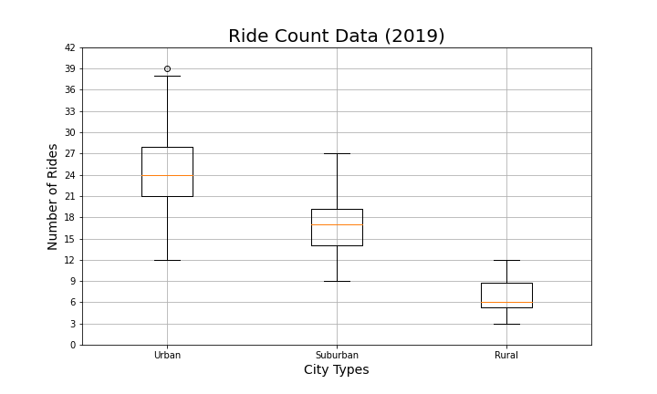
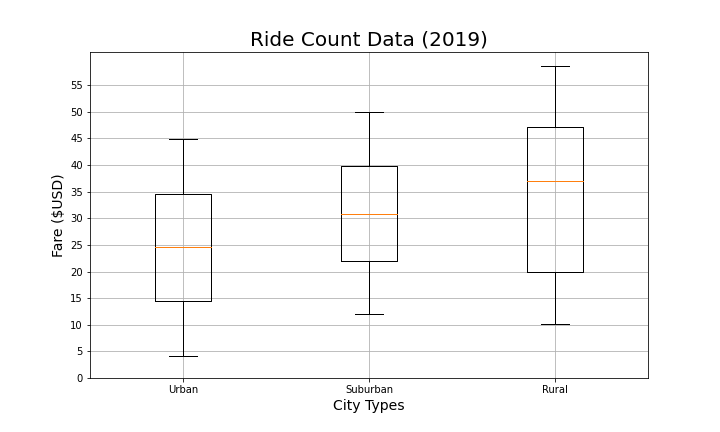
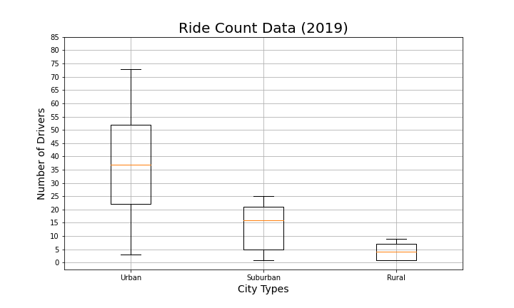
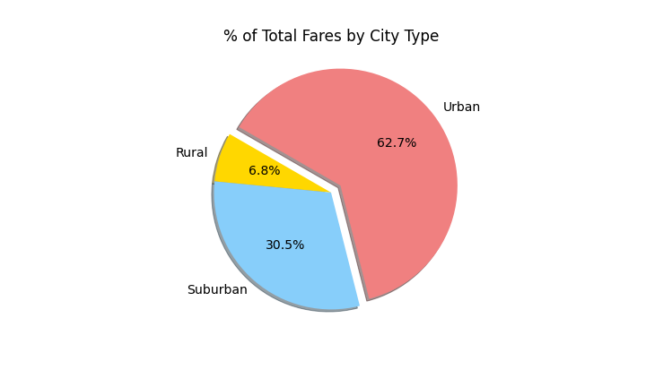
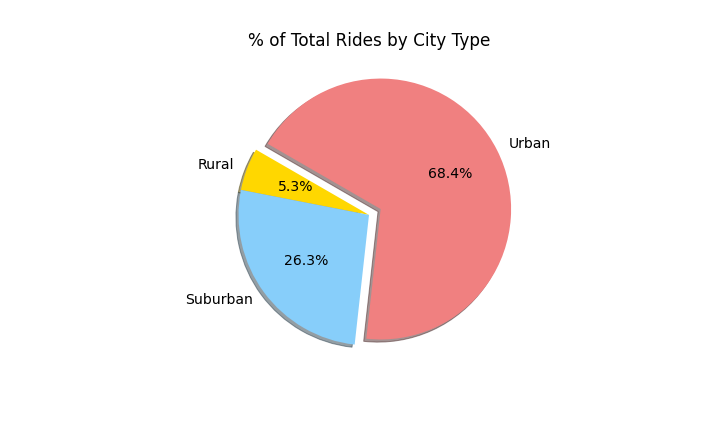
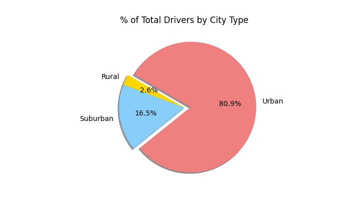
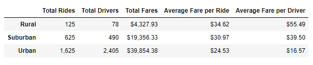
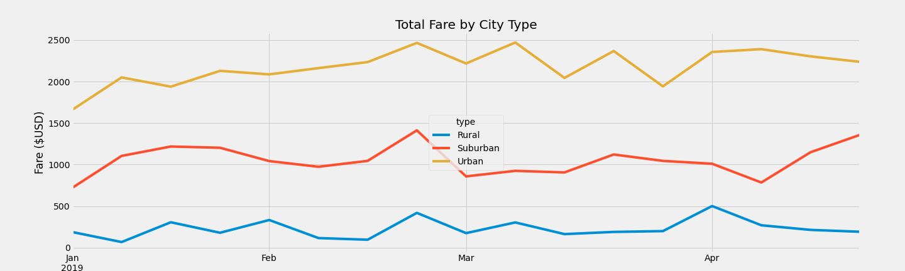

# PyBer_Analysis

In my new role as a Data Analyst with PyBer Ride-Sharing company, V.Isualize the company CEO requested a summary to give insight into last years performace, to inspect, merge and perform calculations creating data Series and data framesand then submitting a report that would allow us to dectect patterns, trends, outliers and correlations at a glance. 

## Project Overview 

A one stop shop for understanding trends for the company PyBer. The summary of this project is to give insight into the company's performance for the year 2019. PyBer data collected from major cities and then catagorized into types: Urban, Suburban and Rural cities. A final Analysis on fares generated in a subsegment of the Ride-Sahring data for each type of city. 

## Resources

- Data Source 1 - city_data.csv
- Data Source 2 - ride_data.csv
- software: Jypyter Lab v2.2.6, Visual Studio Code: 1.49.1(Markdown)

## Results

### Data Overview 

In the below picture we get an overview of the average fares per rides in 2019. The bubble size corelates to the number of drivers in each city respectively. 

- Clearly Urban cities have the most number of drivers, then suburban cities and last rural cities. 
- The bubbles depict that in urban cities as the number of rides increases, the fare tends to be low, and the oposite for rural areas. 

### Number of Rides by City Type 

- The Box and Whisker plot shows that average rides is higher in urban cities as mentioned above. averaging 4 times the number of rides in rural cities.
- Suburban cities average about 3 times more than rural cities.
- Also West Angela is an outlier with the highest ride counts. 

### Fare by City Type

- In this Box and Whisker plot, It is clearly noted that rural cities average high in realtion to fare($).
- Also the spead of rural cities fares are wide when compared to suburban cities and urban cities

### Driver Count by City Type

- Urban cities have larger presence and a large average margin over suburban abd rural cities. 
- Urban cities averaging approximately 10 times when compared to dirver counts in rural cities. 
- Suburban cities averaging about 3 times the number of drivers in rural cities. 

### % of Total Fares by City

### % of Total Rides by City

### % of Total Number of Drivers by City

### Result Overall 

- Total ride count is the heighest in Urban cities with 1625 in number.
- Total number of Drivers in urban cities is 31 times more than in rural areas. 
- Total Fares Urban cities have generated approximately 9 times USD than rural cities.
- Average Fare per ride is seen to be higher in rural areas presumably due to the lack of demand.
- Average Fare per driver also is high in rural areas when compared to suburban and urban cities.

The below line chart, represents data gathered from Jan 2019 to April 2019, to depict the total fares generated by city types in this time period.

- It can be noted that there are small spikes and drops with the fares, but overall shows that there is a trend of fares averaging constantly (Stable) that is seen trough out the 4 months. 

## Recommendations

- PyBer should look into considering reducing or setting a cap on fares in rural cities, which might lead to a market demand for ride-sharing drivers and riders.

- In terms of PyBer becoming the leading Ride-Sharing company, targeting Urban cities would generate higher profits by introducing more drivers, as there is already a large demand seen. 

- Reducing the number of drivers in Urban cities, will certainly create unemployment, but will average a better pay for each driver, leading to a sustainable living in Urban cities.  